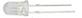
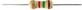
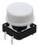
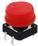
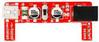
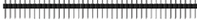
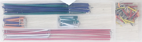
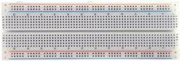
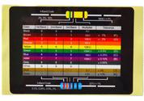

# 2、清单

|编码|名称|描述|数量|图片|
|-|-|-|-|-|
|1|LED|F5-红发红-短|3||
|2|LED|F5-黄发黄-短|3||
|3|LED|F5-绿发绿-短|3||
|4|LED|F5-白发红-短|3||
|5|电阻|碳膜色环 1/4W 5% 100R 编带|30||
|6|电阻|碳膜色环 1/4W 5% 1K 编带|30||
|7|电阻|碳膜色环 1/4W 5% 4.7K 编带|30||
|8|电阻|碳膜色环 1/4W 5% 10K 编带|30||
|9|电阻|碳膜色环 1/4W 5% 47K 编带|30||
|10|电阻|碳膜色环 1/4W 5% 100K 编带|30||
|11|电阻|碳膜色环 1/4W 5% 1M 编带|30||
|12|可调电位器|3386 MU 103（三针直排）|2||
|13|按键帽|A24 白帽(12*12*7.3)圆|2||
|14|按键帽|A24 红帽(12*12*7.3)圆|2||
|15|按键帽|A24 蓝帽(12*12*7.3)圆|2||
|16|轻触按键|12*12*7.3MM 插件|6||
|17|模块|面包板专用电源模块 2路5V/3.3V ARDUINO 红色|1||
|18|排针|1*40P 黑色 2.54 针长3.0等边|1||
|19|面包线|面包板连接线65根|1||
|20|面包板跳线|140根 14种长度|1||
|21|面包板|830孔 ZY-102（ 未包装）|1||
|22|电阻卡|100*70MM|1||

