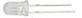
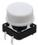
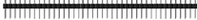
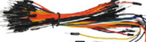

.. _2、清单:

2、清单
=======

.. container:: table-wrapper

   +------+------------+--------------------------------------------+------+-----------+
   | 编码 | 名称       | 描述                                       | 数量 | 图片      |
   +======+============+============================================+======+===========+
   | 1    | LED        | F5-红发红-短                               | 3    | |image23| |
   +------+------------+--------------------------------------------+------+-----------+
   | 2    | LED        | F5-黄发黄-短                               | 3    | |image24| |
   +------+------------+--------------------------------------------+------+-----------+
   | 3    | LED        | F5-绿发绿-短                               | 3    | |image25| |
   +------+------------+--------------------------------------------+------+-----------+
   | 4    | LED        | F5-白发红-短                               | 3    | |image26| |
   +------+------------+--------------------------------------------+------+-----------+
   | 5    | 电阻       | 碳膜色环 1/4W 5% 100R 编带                 | 30   | |image27| |
   +------+------------+--------------------------------------------+------+-----------+
   | 6    | 电阻       | 碳膜色环 1/4W 5% 1K 编带                   | 30   | |image28| |
   +------+------------+--------------------------------------------+------+-----------+
   | 7    | 电阻       | 碳膜色环 1/4W 5% 4.7K 编带                 | 30   | |image29| |
   +------+------------+--------------------------------------------+------+-----------+
   | 8    | 电阻       | 碳膜色环 1/4W 5% 10K 编带                  | 30   | |image30| |
   +------+------------+--------------------------------------------+------+-----------+
   | 9    | 电阻       | 碳膜色环 1/4W 5% 47K 编带                  | 30   | |image31| |
   +------+------------+--------------------------------------------+------+-----------+
   | 10   | 电阻       | 碳膜色环 1/4W 5% 100K 编带                 | 30   | |image32| |
   +------+------------+--------------------------------------------+------+-----------+
   | 11   | 电阻       | 碳膜色环 1/4W 5% 1M 编带                   | 30   | |image33| |
   +------+------------+--------------------------------------------+------+-----------+
   | 12   | 可调电位器 | 3386 MU 103（三针直排）                    | 2    | |image34| |
   +------+------------+--------------------------------------------+------+-----------+
   | 13   | 按键帽     | A24 白帽(12\ *12*\ 7.3)圆                  | 2    | |image35| |
   +------+------------+--------------------------------------------+------+-----------+
   | 14   | 按键帽     | A24 红帽(12\ *12*\ 7.3)圆                  | 2    | |image36| |
   +------+------------+--------------------------------------------+------+-----------+
   | 15   | 按键帽     | A24 蓝帽(12\ *12*\ 7.3)圆                  | 2    | |image37| |
   +------+------------+--------------------------------------------+------+-----------+
   | 16   | 轻触按键   | 12\ *12*\ 7.3MM 插件                       | 6    | |image38| |
   +------+------------+--------------------------------------------+------+-----------+
   | 17   | 模块       | 面包板专用电源模块 2路5V/3.3V ARDUINO 红色 | 1    | |image39| |
   +------+------------+--------------------------------------------+------+-----------+
   | 18   | 排针       | 1*40P 黑色 2.54 针长3.0等边                | 1    | |image40| |
   +------+------------+--------------------------------------------+------+-----------+
   | 19   | 面包线     | 面包板连接线65根                           | 1    | |image41| |
   +------+------------+--------------------------------------------+------+-----------+
   | 20   | 面包板跳线 | 140根 14种长度                             | 1    | |image42| |
   +------+------------+--------------------------------------------+------+-----------+
   | 21   | 面包板     | 830孔 ZY-102（ 未包装）                    | 1    | |image43| |
   +------+------------+--------------------------------------------+------+-----------+
   | 22   | 电阻卡     | 100*70MM                                   | 1    | |image44| |
   +------+------------+--------------------------------------------+------+-----------+

.. |image1| image:: media/1eba37a568de56317c9b9a59738e76ee.png
.. |image2| image:: media/c871ecd95ce2be359e1ac2babcfcfaeb.png
.. |image3| image:: media/fb6f7a17d1cd0704124dd36063ef06bd.png

.. |image5| image:: media/f6a8649da4e79abb2f1d15479f073bb5.jpg
.. |image6| image:: media/f6a8649da4e79abb2f1d15479f073bb5.jpg
.. |image7| image:: media/f6a8649da4e79abb2f1d15479f073bb5.jpg
.. |image8| image:: media/f6a8649da4e79abb2f1d15479f073bb5.jpg
.. |image9| image:: media/f6a8649da4e79abb2f1d15479f073bb5.jpg
.. |image10| image:: media/f6a8649da4e79abb2f1d15479f073bb5.jpg
.. |image11| image:: media/f6a8649da4e79abb2f1d15479f073bb5.jpg
.. |image12| image:: media/6d6025bc96667b6f44070355f2041f13.jpg

.. |image14| image:: media/f4522a2209f122d0b094cb5e4755b211.jpg
.. |image15| image:: media/4be4ce2e80aa9f06e7f02d37c7c5a42a.jpg
.. |image16| image:: media/4be4ce2e80aa9f06e7f02d37c7c5a42a.jpg
.. |image17| image:: media/043582aed0c8ce9aec273d5814320cfa.jpg

.. |image20| image:: media/5f74816773d99c81d1624db265efb6b7.png
.. |image21| image:: media/48648e8442ff9d9c8f57ac99c46fdd04.jpg
.. |image22| image:: media/2e0238b84585943d531ae10d88551d7c.jpg
.. |image23| image:: media/1eba37a568de56317c9b9a59738e76ee.png
.. |image24| image:: media/c871ecd95ce2be359e1ac2babcfcfaeb.png
.. |image25| image:: media/fb6f7a17d1cd0704124dd36063ef06bd.png

.. |image27| image:: media/f6a8649da4e79abb2f1d15479f073bb5.jpg
.. |image28| image:: media/f6a8649da4e79abb2f1d15479f073bb5.jpg
.. |image29| image:: media/f6a8649da4e79abb2f1d15479f073bb5.jpg
.. |image30| image:: media/f6a8649da4e79abb2f1d15479f073bb5.jpg
.. |image31| image:: media/f6a8649da4e79abb2f1d15479f073bb5.jpg
.. |image32| image:: media/f6a8649da4e79abb2f1d15479f073bb5.jpg
.. |image33| image:: media/f6a8649da4e79abb2f1d15479f073bb5.jpg
.. |image34| image:: media/6d6025bc96667b6f44070355f2041f13.jpg

.. |image36| image:: media/f4522a2209f122d0b094cb5e4755b211.jpg
.. |image37| image:: media/4be4ce2e80aa9f06e7f02d37c7c5a42a.jpg
.. |image38| image:: media/4be4ce2e80aa9f06e7f02d37c7c5a42a.jpg
.. |image39| image:: media/043582aed0c8ce9aec273d5814320cfa.jpg

.. |image42| image:: media/5f74816773d99c81d1624db265efb6b7.png
.. |image43| image:: media/48648e8442ff9d9c8f57ac99c46fdd04.jpg
.. |image44| image:: media/2e0238b84585943d531ae10d88551d7c.jpg
