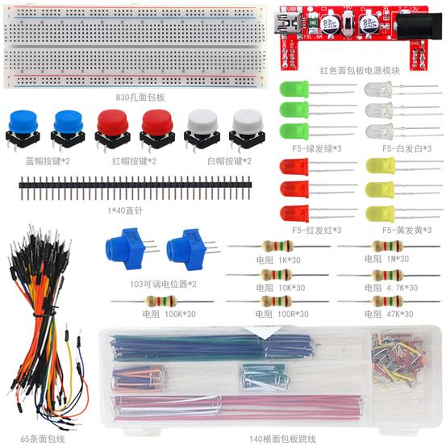

Arduino电子迷基础元件包套件501C

# 1、说明

这个套件包含我们玩单片机时使用到的几个常用元件，如不同阻值的电阻、不同颜色的LED灯、按键、电位器等。元件包中还包括电源模块，该模块输出DC 3.3V或DC 5V。套件适用于各种单片机和树莓派。我们还会根据这些元件，提供一些基于Arduino开发板的一些学习课程，如LED闪烁实验、按键控灯实验、电位器控灯等，让你对这些电子元件和Arduino开发板有个初步的了解。
